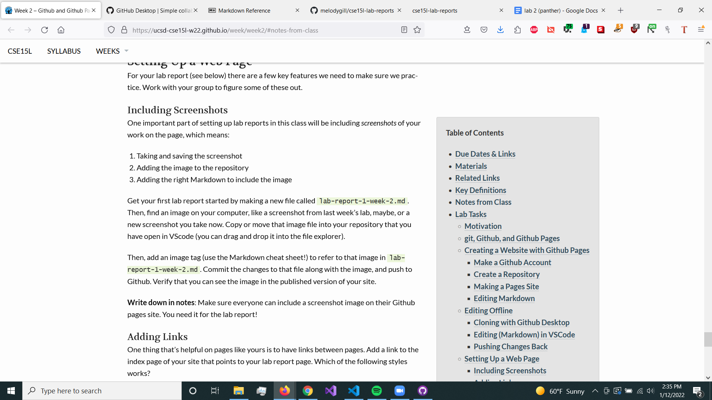

# Home
**Hello!**

[Lab Report 1](lab-report-1-week-2.md)
<br>
[Lab Report 2](lab-report-2-week-4.md)
<br>
[Page 2](page2)


This is `inline code`
This is block code:
```
git status
git add
git commit
```