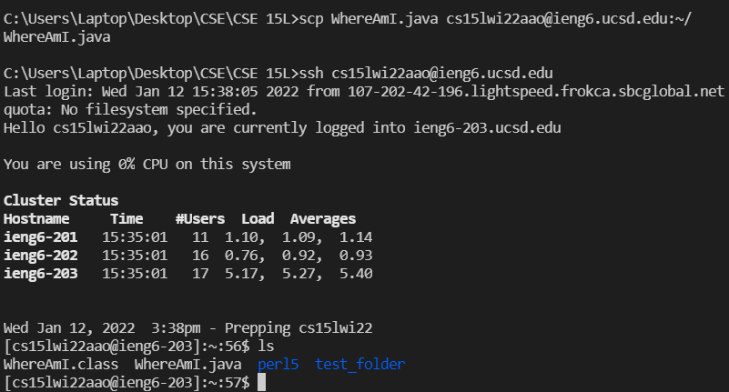

# CSE 15L Week 1 Lab: Logging into ieng6 course-specific accounts
[Home](index.html)
1. Install VSCode
2. Connect to the remote server
3. Commands
4. Move files using scp
5. Set up SSH key to log in faster
6. Optimizing remote running

## Install VScode
The first step is to download VSCode. I already had it downloaded, but if you don't have it, you can download it here: [VScode download](https://code.visualstudio.com/).


## Connect to remote server
Next, to connect to the remote server, make sure you have SSH downloaded (if on Windows) and that you have the name of your course account. Then open a terminal in VScode using Terminal -> New Terminal. The command to connect to the remote server is:

```
ssh cs15lwi22zaao@ieng6.ucsd.edu
```
Enter your password, and you should be able to connect.


## Try out commands
Here are some useful commands to try both in your local environment and on the server.
- `cd` - change directory
- `ls` - list files (-a shows hidden files). `dir` is similar for Windows
- `pwd` - print working directory
- `mkdir [name]` - make directory
- `cat [file name]` - prints contents of file
- `exit`, `logout`, or ctrl-d - log out of the remote server


## Move files with scp
scp (secure copy) is the command to copy files from one computer to another. Assuming you are copying from local to remote, the syntax is:
```scp [file name] cs15lwi22aao@ieng6.ucsd.edu:~/```
The part of the command after the `:` is the directory path that the file will be copied to. `~` means the default directory on the remote server.


## SSH key
Setting up an SSH key will make it so that you don't have to enter your password every time you interact with the remote server. I already had mine mostly set up, but I did have to follow [some extra steps](https://docs.microsoft.com/en-us/windows-server/administration/openssh/openssh_keymanagement#user-key-generation) because I use Windows.

Make sure to copy your public key, stored on your computer in `id_rsa.pub`, into a new folder called `.ssh` that you create on the remote server. Then you will be able to log in without entering your password, as you can see me do here:


## Optimizing remote running