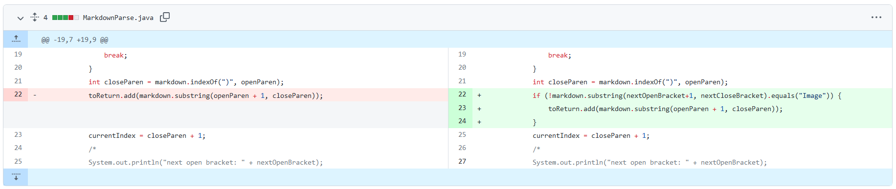
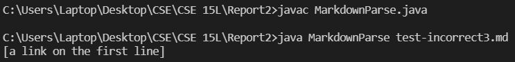

# CSE 15L Week 4 Lab: Testing and Debugging
[Home](index.html)

This report shows the process of testing and debugging `MarkdownParse.java`.

## Error 1
Github diff for the code change that fixed the error:

Test file that contains the failure-inducing input: [test-incorrect.md](week4_files/test-incorrect.md)

Symptom of the failure-inducing input:

The failure-inducing input caused the code to enter an infinite loop (note that the program is printing the value of `currentIndex`, which never reaches the value necessary to break out of the while loop). This is because the code searches for an open parenthese following a close bracket, and when it can't find one in the failure-inducing input, it does not increment `currentIndex`. The loop then runs forever as the code searches the same part of the input for an open parenthese which is not there.

## Error 2
Github diff for the code change that fixed the error:

Test file that contains the failure-inducing input: [test-incorrect2.md](week4_files/test-incorrect2.md)

Symptom of the failure-inducing input:

The old version of the program would list image files as well as URLs in the output. In the symptoms screenshot, `report1_command.png` is an image and should not be listed, but since it is within parentheses after brackets, the program treats it like a link. The bug in this case is that the program does not account for images.

## Error 3
Github diff for the code change that fixed the error:

Test file that contains the failure-inducing input: [test-incorrect3.md](week4_files/test-incorrect3.md)

Symptom of the failure-inducing input:

Markdown files do not recognize spaces in links, so the failure-inducing input should contain zero links. However, the program did not check for spaces, so it counted `a link on the first line` as a legitimate link, and printed it out.