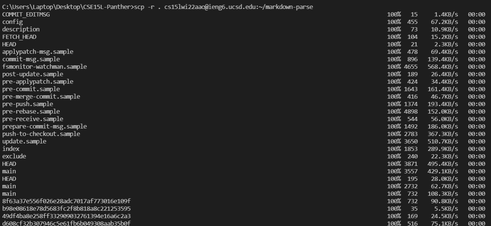
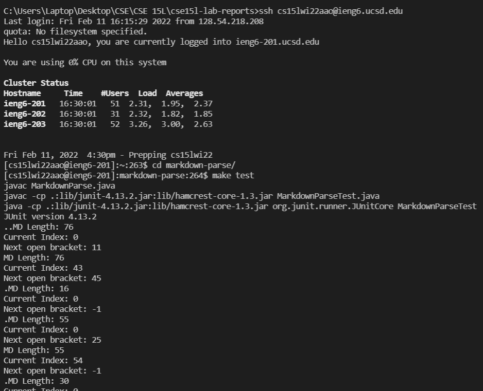
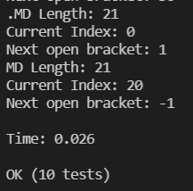

# CSE 15L Week 6 Lab: Copying Whole Directories
[Home](index.html)

This report shows the command `scp -r`, which is used to copy entire directories.

Copying my entire directory to ieng6: (my `markdown-parse` folder is called `CSE15L_Panther`)

Logging into ieng6, compiling and running my tests: (I omitted some of the test output because it didn't fit on my screen.)

Combining commands to copy the directory and run the tests on ieng6 all in one line: