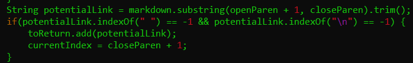
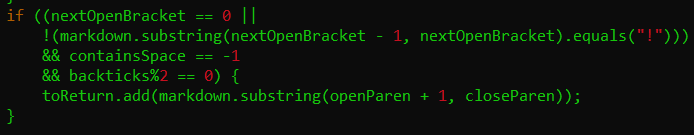

# CSE 15L Week 8 Lab: Large Amounts of Tests
[Home](index.html)

I found the tests with different results by using the `diff` command. I saved the results of running the two versions of `MarkdownParse` into two files, and then ran `diff` on them to find the differences in output.


## Test 194
Test file:
```[Foo*bar\]]:my_(url) 'title (with parens) \n[Foo*bar\]]```

Output of my group's implementation:
```[]```

Output of the provided implementation:
```[url]```

Expected output according to VSCode's markdown preview:
```[]```

I believe that my group's implementation is correct. The provided implementation does not check to make sure that there are no characters between the `]` and `(` of a link, which would break the link syntax. Here is the section of code that should be fixed in the provided implementation:




## Test 494
Test file:
```[link](\foo\))```

Output of my group's implementation:
```[\(foo\]```

Output of the provided implementation:
```[\(foo\)]```

Expected output according to VSCode's markdown preview:
```[foo)]```

I believe that neither implementation is correct. One of the bugs with my implementation is that my implementation does not ignore backslashes, so the backslashes are included in the link. The part of the code that contains the problem is the following (does not ignore backslashes).


